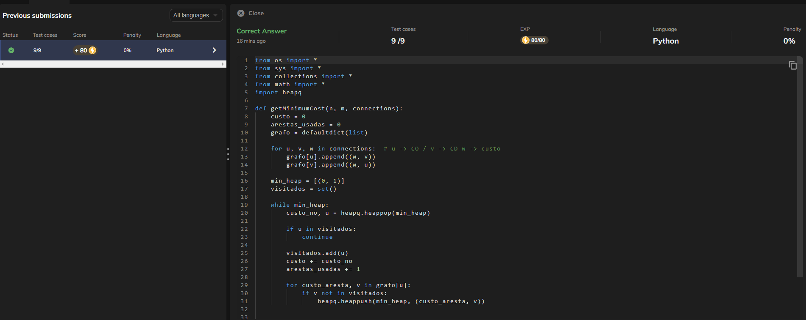
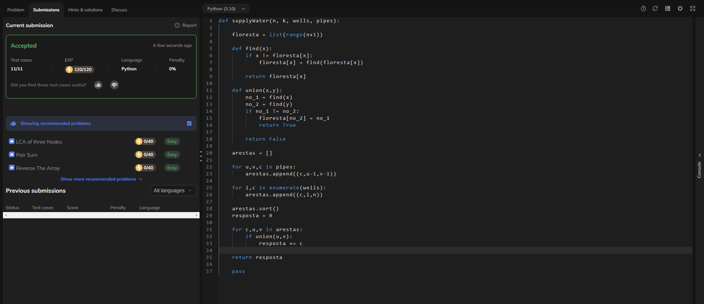
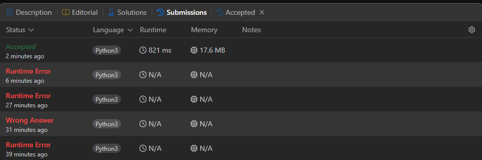

# Grafos1-LeetCode_Problems

**Número da Lista**: 63
**Conteúdo da Disciplina**: Grafos-2

## Alunos

| Matrícula | Aluno                      |
| --------- | -------------------------- |
| 202016963 | Mateus Vinicius Vieira     |
| 211039680 | Pedro Lucas Dourado Santos |

## Sobre

Este projeto consiste na resolução de questões da plataforma Code360 e LeetCode variando nas dificuldades de médio e difícil. O objetivo é utilizar o conteúdo em sala.

| Problema | Nome                                                                                                                                                                | Nível de Dificuldade |
| -------- | ------------------------------------------------------------------------------------------------------------------------------------------------------------------- | -------------------- |
| 1135     | [Connecting Cities With Minimum Cost](https://www.naukri.com/code360/problems/connecting-cities-with-minimum-cost_1386586?leftPanelTabValue=PROBLEM)                | Médio                |
| 1168     | [Water Supply In A Village](https://www.naukri.com/code360/problems/water-supply-in-a-village_1380956)                                                              | Difícil              |
| 1489     | [Find Critical And Pseudo Critical Edges in Minimum Spanning Tree](https://leetcode.com/problems/find-critical-and-pseudo-critical-edges-in-minimum-spanning-tree/) | Difícil              |

## Screenshots

### [Connecting Cities With Minimum Cost](https://www.naukri.com/code360/problems/connecting-cities-with-minimum-cost_1386586?leftPanelTabValue=PROBLEM)

### [Water Supply In A Village](https://www.naukri.com/code360/problems/water-supply-in-a-village_1380956)

### [Find Critical And Pseudo Critical Edges in Minimum Spanning Tree](https://leetcode.com/problems/find-critical-and-pseudo-critical-edges-in-minimum-spanning-tree/)

## Linguagem Utilizada

- Python

## Uso

Entrar na plataforma [Code 360](https://www.naukri.com/code360), procurar pelo número do exercício, colar na aba code e clicar em Run

## Outros

[Vídeo de Apresentação](https://youtu.be/eSItnLOjYzA?si=fObfndcgLP0jhsYO)
